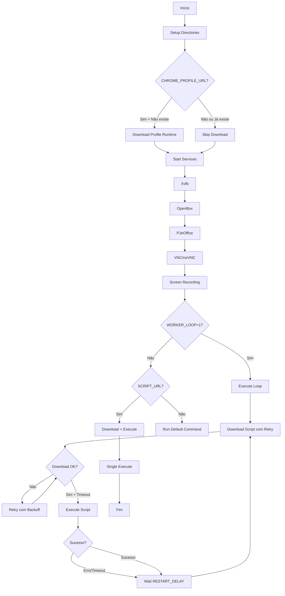

# 🤖 RPA Worker Selenium - Documentação para Agentes AI

## 📖 Visão Geral

O **rpa-worker-selenium** é um container Docker pronto para produção, otimizado para executar scripts Python com automação web usando Selenium. Foi especialmente projetado para tarefas de RPA (Robotic Process Automation) em sistemas jurídicos brasileiros, com suporte completo para PJeOffice, certificados digitais A1/CA e execução headful.

### 🎯 Casos de Uso

- **Automação Web Headful**: Execução de automações que requerem renderização visual completa
- **PJeOffice**: Interação com sistemas do Poder Judiciário Eletrônico brasileiro
- **Certificados Digitais**: Suporte para tokens A1 e certificados CA com dialogs de senha
- **RPA com Retry**: Sistema de download dinâmico de scripts com retry e fallback
- **Workers Distribuídos**: Execução em loop com auto-restart para workers de longa duração
- **Debug Remoto**: VNC e noVNC para inspeção visual em tempo real

## 🏗️ Arquitetura

```
┌─────────────────────────────────────────────────────────┐
│                    GHCR Image                           │
│   ghcr.io/nailtongomes/rpa-worker-selenium              │
└─────────────────────────────────────────────────────────┘
                        ▲
                        │ Build via GitHub Actions
                        │
┌─────────────────────────────────────────────────────────┐
│                  Dockerfile.trixie                      │
│  ┌─────────────────────────────────────────────────┐   │
│  │ Builder Stage:                                  │   │
│  │ - Chrome 142+ download                          │   │
│  │ - ChromeDriver matching                         │   │
│  │ - Firefox ESR + GeckoDriver                     │   │
│  └─────────────────────────────────────────────────┘   │
│  ┌─────────────────────────────────────────────────┐   │
│  │ Runtime Stage (Debian Trixie):                  │   │
│  │ - Python 3.12 + venv                            │   │
│  │ - Xvfb + OpenBox + X11                          │   │
│  │ - VNC/noVNC (conditional)                       │   │
│  │ - FFmpeg (conditional)                          │   │
│  │ - PDF Tools (conditional)                       │   │
│  │ - PJeOffice (conditional)                       │   │
│  │ - Chrome Profile (build-time ou runtime)       │   │
│  └─────────────────────────────────────────────────┘   │
└─────────────────────────────────────────────────────────┘
                        ▼
┌─────────────────────────────────────────────────────────┐
│                   entrypoint.sh                         │
│  1. Setup directories                                   │
│  2. Download Chrome profile (if runtime URL)            │
│  3. Start Xvfb → OpenBox → PJeOffice                   │
│  4. Start VNC → noVNC (debug)                          │
│  5. Start Screen Recording (debug)                      │
│  6. Download script (com retry + backoff)               │
│  7. Execute script (loop ou single)                     │
│  8. Auto-restart após erro/timeout                      │
└─────────────────────────────────────────────────────────┘
```

### Componentes Principais

- **Container Base**: Debian Trixie (testing/13) - mais atualizado que Bookworm
- **Browsers**: Chrome 142+ e Firefox ESR com drivers correspondentes
- **Display**: Xvfb para execução headful sem GPU física
- **Window Manager**: OpenBox para gerenciar janelas de dialogs
- **Sistema de Scripts**: Download dinâmico com retry exponencial e fallback
- **Debugging**: VNC/noVNC para acesso visual remoto + screen recording

## 🔧 Componentes Principais

### Dockerfile.trixie

O Dockerfile usa **multi-stage build** para otimizar o tamanho final da imagem:

#### Stage 1: Builder
```dockerfile
FROM debian:trixie-slim AS builder
```

**Responsabilidades**:
- Download do Chrome e ChromeDriver das fontes oficiais (Chrome for Testing)
- Download do Firefox ESR e GeckoDriver do Mozilla
- Validação de versões e checksums
- Preparação de binários para cópia no runtime stage

**Build Args Disponíveis**:
- `CHROME_VERSION`: Versão específica do Chrome (padrão: 142.0.7444.162)
- `GECKODRIVER_VERSION`: Versão do GeckoDriver (padrão: 0.36.0)

#### Stage 2: Runtime
```dockerfile
FROM debian:trixie
```

**Responsabilidades**:
- Instalação de dependências do sistema (X11, GTK, NSS, etc)
- Configuração do Python 3.12 com venv (PEP 668)
- Cópia de browsers do builder stage
- Instalação de pacotes Python via pip
- Configuração de usuário e permissões
- Download condicional de Chrome profile

**Build Args Principais**:

| Build Arg | Padrão | Descrição |
|-----------|--------|-----------|
| `BUILD_PJEOFFICE` | 0 | Instala PJeOffice 2.5.16 + Java 21 |
| `ENABLE_PDF_TOOLS` | 1 | Instala ImageMagick + Ghostscript |
| `ENABLE_VNC` | 0 | Instala x11vnc para debug remoto |
| `ENABLE_NOVNC` | 0 | Instala noVNC + websockify |
| `ENABLE_FFMPEG` | 0 | Instala FFmpeg para screen recording |
| `CHROME_PROFILE_URL` | "" | URL do .zip com profile do Chrome |

**Otimizações Aplicadas**:
- ✅ `--no-install-recommends` em todos os `apt-get install`
- ✅ `rm -rf /var/lib/apt/lists/*` para limpar cache do apt
- ✅ `pip cache purge` após instalação de pacotes Python
- ✅ Combinação de comandos RUN quando possível
- ✅ Multi-stage para separar build de runtime
- ✅ Build condicional de features via ARGs

**Estrutura de Diretórios**:
```
/app/                      # Working directory
├── src/                   # Helper scripts baixados dinamicamente
├── logs/                  # Logs de VNC, noVNC, etc
├── tmp/                   # Arquivos temporários
├── recordings/            # Gravações de tela (se habilitado)
└── .pki/nssdb/           # NSS database para certificados

/opt/
├── chrome/                # Chrome binaries
├── firefox/               # Firefox binaries
├── pjeoffice/             # PJeOffice (se BUILD_PJEOFFICE=1)
├── venv/                  # Python virtual environment
└── novnc/                 # noVNC (se ENABLE_NOVNC=1)

/usr/local/share/
└── chrome-profile/        # Chrome profile extraído (se URL fornecida)
```

### entrypoint.sh

Script bash que orquestra a inicialização do container e execução de scripts.

#### Fluxo de Inicialização



#### Funcionalidades Principais

**1. Gerenciamento de Serviços**

Cada serviço é iniciado condicionalmente baseado em variáveis de ambiente:

```bash
start_xvfb()         # USE_XVFB=1
start_openbox()      # USE_OPENBOX=1 (requer Xvfb)
start_pjeoffice()    # USE_PJEOFFICE=1
start_vnc()          # USE_VNC=1 (requer Xvfb)
start_novnc()        # USE_NOVNC=1 (requer VNC)
start_screen_recording()  # USE_SCREEN_RECORDING=1 (requer Xvfb)
```

**2. Download de Chrome Profile em Runtime**

Se `CHROME_PROFILE_URL` não foi usado no build time, o entrypoint pode baixar no runtime:

```bash
download_chrome_profile() {
    # Checa se já existe do build time
    # Se não, baixa de $CHROME_PROFILE_URL
    # Extrai para /usr/local/share/chrome-profile/
}
```

**3. Sistema de Download com Retry**

```bash
download_script_with_retry() {
    # Janela máxima: 90 segundos
    # Backoff exponencial: 5s → 10s → 20s → 40s (cap)
    # Validação de arquivo após download
    # Retorna 0 em sucesso, 1 em falha
}
```

**4. Execução em Loop (Worker Mode)**

```bash
execute_with_loop() {
    # Loop infinito com:
    # - Timeout por iteração (WORKER_TIMEOUT, padrão 1h)
    # - Delay entre iterações (WORKER_RESTART_DELAY, padrão 2min)
    # - Cleanup automático entre iterações
    # - Logs com timestamps e emojis
}
```

**5. Logging com Emojis**

Para facilitar a leitura de logs em produção:

```bash
log_timestamp()      # [2024-01-15 10:30:45]
🖥️  Xvfb            # Display virtual
🪟 OpenBox          # Window manager
📄 PJeOffice        # Sistema PJe
⬇️  Download         # Download de arquivos
▶️  Execute          # Execução de script
✅ Success          # Operação bem-sucedida
❌ Error            # Falha/erro
⚠️  Warning         # Aviso
ℹ️  Info            # Informação
🔄 Retry            # Tentando novamente
⏳ Waiting         # Aguardando
🔁 Loop            # Modo loop
🚀 Starting        # Iniciando
💤 Sleep           # Dormindo
🧹 Cleanup         # Limpeza
```

### GitHub Actions

Arquivo: `.github/workflows/build-push-ghcr.yml`

#### Triggers

1. **Push para main**: Quando `Dockerfile.trixie` ou o próprio workflow mudam
2. **workflow_dispatch**: Trigger manual com input opcional `tag_suffix`

#### Steps do Workflow

```yaml
1. Checkout code
2. Set up Docker Buildx
3. Login to GHCR (usando GITHUB_TOKEN)
4. Generate tags and labels
   - latest
   - sha-{7char}
   - YYYYMMDD-HHmmss
5. Build and push
   - Platform: linux/amd64
   - Build args fixos: BUILD_PJEOFFICE=1, ENABLE_PDF_TOOLS=1
   - Build arg variável: CHROME_PROFILE_URL (de secrets)
   - Cache: type=gha,mode=max
6. Build Summary (no GitHub UI)
```

#### Estratégia de Cache

```yaml
cache-from: type=gha           # Lê cache de runs anteriores
cache-to: type=gha,mode=max    # Salva todas as layers
```

**Benefícios**:
- Builds incrementais muito mais rápidos
- Cache compartilhado entre builds
- Otimização automática de layers

## 📦 Build e Deploy

### Build Args

#### BUILD_PJEOFFICE
**Tipo**: Boolean (0 ou 1)  
**Padrão**: 0  
**Descrição**: Instala PJeOffice Pro v2.5.16 e Java 21 JRE headless  
**Uso**: Obrigatório para automações que interagem com sistemas PJe  
**Tamanho**: +~300MB na imagem final  

```bash
docker build --build-arg BUILD_PJEOFFICE=1 -f Dockerfile.trixie -t rpa-pje .
```

#### ENABLE_PDF_TOOLS
**Tipo**: Boolean (0 ou 1)  
**Padrão**: 0  
**Descrição**: Instala ImageMagick e Ghostscript para manipulação de PDFs  
**Uso**: Necessário para assinar PDFs, converter imagens, etc  
**Tamanho**: +~50MB na imagem final  

```bash
docker build --build-arg ENABLE_PDF_TOOLS=1 -f Dockerfile.trixie -t rpa-pdf .
```

#### CHROME_PROFILE_URL
**Tipo**: String (URL)  
**Padrão**: "" (vazio)  
**Descrição**: URL de um arquivo .zip contendo profile pré-configurado do Chrome  
**Uso**: 
- **Build time**: Baixa e extrai durante o build (imagem fica maior)
- **Runtime**: Se não fornecido no build, pode ser fornecido via ENV no runtime

**Estrutura esperada do .zip**:
```
chrome-profile.zip
└── Default/
    ├── Preferences
    ├── Extensions/
    └── ...
```

**Exemplos**:

Build time:
```bash
docker build \
  --build-arg CHROME_PROFILE_URL="https://storage.example.com/profiles/pje-profile.zip" \
  -f Dockerfile.trixie -t rpa-custom .
```

Runtime:
```bash
docker run -e CHROME_PROFILE_URL="https://storage.example.com/profiles/pje-profile.zip" rpa-worker
```

**⚠️ Segurança**: Use GitHub Secrets ou variáveis de ambiente para URLs privadas

#### ENABLE_VNC / ENABLE_NOVNC / ENABLE_FFMPEG
**Tipo**: Boolean (0 ou 1)  
**Descrição**: Features condicionais para debugging  
**Uso**: Apenas em imagens de debug/desenvolvimento  

### Variáveis de Ambiente

#### Runtime Configuration

| Variável | Padrão | Descrição |
|----------|--------|-----------|
| `SCRIPT_URL` | - | URL do script Python para download e execução |
| `HELPER_URLS` | - | URLs de scripts auxiliares (separados por vírgula) |
| `CHROME_PROFILE_URL` | "" | URL do profile do Chrome (se não usado no build) |
| `WORKER_LOOP` | 0 | Habilita execução em loop infinito |
| `WORKER_TIMEOUT` | 3600 | Timeout por iteração (segundos) |
| `WORKER_RESTART_DELAY` | 120 | Delay entre iterações (segundos) |

#### Display Configuration

| Variável | Padrão | Descrição |
|----------|--------|-----------|
| `USE_XVFB` | 0 | Inicia Xvfb (display virtual) |
| `USE_OPENBOX` | 0 | Inicia OpenBox (window manager) |
| `DISPLAY` | :99 | Número do display X11 |
| `SCREEN_WIDTH` | 1366 | Largura da tela virtual |
| `SCREEN_HEIGHT` | 768 | Altura da tela virtual |

#### PJeOffice Configuration

| Variável | Padrão | Descrição |
|----------|--------|-----------|
| `USE_PJEOFFICE` | 0 | Inicia PJeOffice no boot |
| `PJEOFFICE_EXECUTABLE` | /opt/pjeoffice/pjeoffice-pro.sh | Caminho do executável |
| `PJEOFFICE_CONFIG_DIR` | /app/.pjeoffice-pro | Diretório de configuração |
| `PJEOFFICE_CONFIG_FILE` | ${CONFIG_DIR}/pjeoffice-pro.config | Arquivo de config |

#### Debug Configuration

| Variável | Padrão | Descrição |
|----------|--------|-----------|
| `USE_VNC` | 0 | Inicia servidor VNC |
| `USE_NOVNC` | 0 | Inicia noVNC (web-based VNC) |
| `VNC_PORT` | 5900 | Porta do servidor VNC |
| `NOVNC_PORT` | 6080 | Porta do noVNC WebSocket |
| `USE_SCREEN_RECORDING` | 0 | Grava tela durante execução |
| `RECORDING_DIR` | /app/recordings | Diretório de gravações |
| `RECORDING_FILENAME` | recording_YYYYMMDD_HHMMSS.mp4 | Nome do arquivo |

### Tags da Imagem

O workflow gera 3 tags automaticamente para cada build:

#### `latest` (com suffix opcional)
**Uso**: Produção  
**Atualização**: A cada push para main  
**Exemplo**: `ghcr.io/nailtongomes/rpa-worker-selenium:latest`

Pull sempre da última versão:
```bash
docker pull ghcr.io/nailtongomes/rpa-worker-selenium:latest
```

#### `sha-{hash}` (7 primeiros caracteres)
**Uso**: Referência específica a um commit  
**Atualização**: Único por commit  
**Exemplo**: `ghcr.io/nailtongomes/rpa-worker-selenium:sha-a1b2c3d`

Pull de uma versão específica:
```bash
docker pull ghcr.io/nailtongomes/rpa-worker-selenium:sha-a1b2c3d
```

#### `YYYYMMDD-HHmmss` (timestamp UTC)
**Uso**: Rastreamento temporal, rollback  
**Atualização**: Único por build  
**Exemplo**: `ghcr.io/nailtongomes/rpa-worker-selenium:20241231-103045`

Pull de uma versão de um momento específico:
```bash
docker pull ghcr.io/nailtongomes/rpa-worker-selenium:20241231-103045
```

**Tag Suffix Manual**:
Quando usar workflow_dispatch com `tag_suffix`:
```bash
# Gera: latest-debug, sha-a1b2c3d-debug, 20241231-103045-debug
tag_suffix: "-debug"
```

## 🚀 Uso

### Pull da Imagem

```bash
# Latest (recomendado para produção)
docker pull ghcr.io/nailtongomes/rpa-worker-selenium:latest

# Commit específico (para reproduzibilidade)
docker pull ghcr.io/nailtongomes/rpa-worker-selenium:sha-a1b2c3d

# Timestamp específico (para rollback)
docker pull ghcr.io/nailtongomes/rpa-worker-selenium:20241231-103045
```

### Executar Localmente

#### Modo Simples (Single Run)

```bash
docker run --rm \
  -e SCRIPT_URL="https://exemplo.com/meu-script.py" \
  -e USE_XVFB=1 \
  ghcr.io/nailtongomes/rpa-worker-selenium:latest
```

#### Modo Worker (Loop Infinito)

```bash
docker run -d \
  --name rpa-worker-01 \
  -e SCRIPT_URL="https://exemplo.com/meu-script.py" \
  -e WORKER_LOOP=1 \
  -e WORKER_TIMEOUT=3600 \
  -e WORKER_RESTART_DELAY=120 \
  -e USE_XVFB=1 \
  -e USE_OPENBOX=1 \
  -e USE_PJEOFFICE=1 \
  ghcr.io/nailtongomes/rpa-worker-selenium:latest

# Ver logs
docker logs -f rpa-worker-01
```

#### Com Chrome Profile Customizado

```bash
docker run --rm \
  -e SCRIPT_URL="https://exemplo.com/script.py" \
  -e CHROME_PROFILE_URL="https://storage.exemplo.com/profile.zip" \
  -e USE_XVFB=1 \
  ghcr.io/nailtongomes/rpa-worker-selenium:latest
```

#### Com Debug (VNC + noVNC)

```bash
docker run -d \
  --name rpa-debug \
  -p 6080:6080 \
  -e SCRIPT_URL="https://exemplo.com/script.py" \
  -e USE_XVFB=1 \
  -e USE_VNC=1 \
  -e USE_NOVNC=1 \
  ghcr.io/nailtongomes/rpa-worker-selenium:latest

# Abrir no navegador: http://localhost:6080/vnc.html
```

### Integração com Kestra

Exemplo de flow YAML para orquestração com Kestra:

```yaml
id: rpa-worker-pje
namespace: automacao

tasks:
  - id: run-rpa
    type: io.kestra.plugin.docker.Run
    image: ghcr.io/nailtongomes/rpa-worker-selenium:latest
    env:
      SCRIPT_URL: "{{ vars.script_url }}"
      USE_XVFB: "1"
      USE_OPENBOX: "1"
      USE_PJEOFFICE: "1"
      N3_API_BASE_URL: "{{ secret('N3_API_BASE_URL') }}"
      N3_TOKEN: "{{ secret('N3_TOKEN') }}"
      SENHA_TOKEN_A1: "{{ secret('SENHA_TOKEN_A1') }}"
    volumes:
      - /data/rpa/db:/app/db
      - /data/rpa/logs:/app/logs
    shm_size: 2gb
    memory: 2g
    cpu: 1.0

triggers:
  - id: schedule
    type: io.kestra.core.models.triggers.types.Schedule
    cron: "0 */6 * * *"  # A cada 6 horas
```

### Docker Compose (Worker em Loop)

```yaml
version: '3.8'

services:
  rpa-worker-01:
    image: ghcr.io/nailtongomes/rpa-worker-selenium:latest
    container_name: rpa-worker-01
    restart: always
    
    environment:
      # Script URL
      SCRIPT_URL: "https://storage.example.com/scripts/capas-worker.py"
      
      # Worker configuration
      WORKER_LOOP: "1"
      WORKER_TIMEOUT: "3600"        # 1 hora por iteração
      WORKER_RESTART_DELAY: "120"   # 2 minutos entre iterações
      
      # Display services
      USE_XVFB: "1"
      USE_OPENBOX: "1"
      USE_PJEOFFICE: "1"
      
      # Chrome profile
      CHROME_PROFILE_URL: "https://storage.example.com/profiles/worker-01.zip"
      
      # API credentials (use .env file)
      N3_API_BASE_URL: "${N3_API_BASE_URL}"
      N3_TOKEN: "${N3_TOKEN}"
      SENHA_TOKEN_A1: "${SENHA_TOKEN_A1}"
      SECRET_2FA_CNJ: "${SECRET_2FA_CNJ}"
      
      # Worker ID
      WORKER_ID: "capas-worker-01"
      TZ: "America/Fortaleza"
      
    volumes:
      - ./data/db:/app/db
      - ./data/logs:/app/logs
      - ./data/tmp:/app/tmp
      - ./data/src:/app/src
    
    shm_size: "2gb"
    
    deploy:
      resources:
        limits:
          memory: 2g
          cpus: '1.0'
        reservations:
          memory: 1g
    
    logging:
      driver: "json-file"
      options:
        max-size: "10m"
        max-file: "3"

  rpa-worker-02:
    extends: rpa-worker-01
    container_name: rpa-worker-02
    environment:
      WORKER_ID: "capas-worker-02"
      CHROME_PROFILE_URL: "https://storage.example.com/profiles/worker-02.zip"
```

**Uso**:
```bash
# Criar arquivo .env com secrets
cat > .env << EOF
N3_API_BASE_URL=https://api.example.com
N3_TOKEN=seu-token-aqui
SENHA_TOKEN_A1=senha-do-certificado
SECRET_2FA_CNJ=secret-2fa-totp
EOF

# Iniciar workers
docker compose up -d

# Ver logs de todos os workers
docker compose logs -f

# Ver logs de um worker específico
docker compose logs -f rpa-worker-01

# Escalar workers
docker compose up -d --scale rpa-worker=5
```

### Docker Compose (Debug com noVNC)

```yaml
version: '3.8'

services:
  rpa-debug:
    image: ghcr.io/nailtongomes/rpa-worker-selenium:latest
    container_name: rpa-debug
    
    ports:
      - "6080:6080"  # noVNC web interface
      - "5900:5900"  # VNC direct access (optional)
    
    environment:
      SCRIPT_URL: "https://example.com/test-script.py"
      USE_XVFB: "1"
      USE_OPENBOX: "1"
      USE_VNC: "1"
      USE_NOVNC: "1"
      USE_SCREEN_RECORDING: "1"  # Grava tela para análise
      WORKER_LOOP: "0"  # Single run para debug
    
    volumes:
      - ./recordings:/app/recordings
      - ./logs:/app/logs
    
    shm_size: "2gb"
```

Acesso:
- noVNC (navegador): http://localhost:6080/vnc.html
- VNC direto: vnc://localhost:5900

## 🎨 Estilo e Padrões

### Para todos os arquivos

- ✅ Use comentários claros e concisos
- ✅ Prefira variáveis de ambiente para configuração
- ✅ Valide inputs antes de usar
- ✅ Sempre limpe recursos ao finalizar
- ✅ Use exit codes apropriados (0 = sucesso, 1+ = erro)
- ✅ Nunca hardcode credenciais ou secrets

### Para scripts Bash

```bash
#!/bin/bash
set -e                          # Fail fast em erros
# set -u pode ser usado com cuidado (variáveis undefined)

# Use funções para organizar código
function_name() {
    local var="value"           # Variáveis locais
    echo "Message"              # Output descritivo
    return 0                    # Return code explícito
}

# Prefixe variáveis de ambiente claramente
export MY_VAR="${MY_VAR:-default}"

# Use validação de pré-condições
if [ -z "$REQUIRED_VAR" ]; then
    echo "ERROR: REQUIRED_VAR not set"
    exit 1
fi
```

### Para Python

```python
#!/usr/bin/env python3
"""
Module docstring: breve descrição do propósito.
"""

from typing import Optional, List

def function_name(param: str, optional: Optional[int] = None) -> bool:
    """
    Function docstring: o que ela faz, params, retorno.
    
    Args:
        param: Descrição do parâmetro
        optional: Parâmetro opcional com default
        
    Returns:
        True em sucesso, False em falha
    """
    # Use logging ao invés de prints quando apropriado
    import logging
    logger = logging.getLogger(__name__)
    
    logger.info(f"Processing {param}")
    
    try:
        # Lógica principal
        result = do_something(param)
        return True
    except Exception as e:
        logger.error(f"Failed: {e}")
        return False
```

### Para YAML

```yaml
# Indentação de 2 espaços (consistente)
version: '3.8'

services:
  # Comentários explicando seções complexas
  my-service:
    image: example:latest
    
    # Agrupe configurações relacionadas
    environment:
      - VAR_ONE=value
      - VAR_TWO=value
    
    # Use labels para metadata
    labels:
      - "description=My service description"
```

## 🔒 Segurança

### Práticas Recomendadas

1. **Nunca Hardcode Secrets**
   ```bash
   # ❌ ERRADO
   export API_KEY="abc123"
   
   # ✅ CORRETO
   export API_KEY="${API_KEY}"  # Vem de secrets/env
   ```

2. **Use GitHub Secrets para Build**
   ```yaml
   # .github/workflows/build-push-ghcr.yml
   env:
     CHROME_PROFILE_URL: ${{ secrets.CHROME_PROFILE_URL }}
   ```

3. **Use .env para Runtime**
   ```bash
   # Criar .env local (NUNCA commitar!)
   cat > .env << EOF
   N3_TOKEN=seu-token-aqui
   SENHA_TOKEN_A1=senha-cert
   EOF
   
   # Usar com docker compose
   docker compose --env-file .env up
   ```

4. **Adicione .env ao .gitignore**
   ```gitignore
   # .gitignore
   .env
   .env.local
   *.key
   *.pem
   *.pfx
   ```

5. **Valide Inputs**
   ```bash
   if [[ ! "$URL" =~ ^https:// ]]; then
       echo "ERROR: URL must use HTTPS"
       exit 1
   fi
   ```

## 🧪 Testes e Validação

### Validar Workflow Syntax

```bash
# Instalar act (GitHub Actions local runner)
brew install act  # ou equivalente no Linux

# Validar syntax
act -n

# Rodar workflow localmente
act push
```

### Testar Build Local

```bash
# Build completo
DOCKER_BUILDKIT=1 docker build \
  --build-arg BUILD_PJEOFFICE=1 \
  --build-arg ENABLE_PDF_TOOLS=1 \
  --build-arg CHROME_PROFILE_URL="https://example.com/profile.zip" \
  -f Dockerfile.trixie \
  -t test-image \
  .

# Verificar tamanho
docker images test-image

# Testar execução
docker run --rm test-image python --version
docker run --rm test-image chrome --version
```

### Testar Entrypoint

```bash
# Teste de inicialização
docker run --rm -e USE_XVFB=1 test-image sleep 5

# Teste de download com retry
docker run --rm \
  -e SCRIPT_URL="https://example.com/script.py" \
  -e USE_XVFB=1 \
  test-image

# Teste de loop mode
docker run --rm \
  -e SCRIPT_URL="https://example.com/script.py" \
  -e WORKER_LOOP=1 \
  -e WORKER_TIMEOUT=10 \
  -e WORKER_RESTART_DELAY=5 \
  test-image
```

### Smoke Tests Automáticos

O repositório inclui testes de smoke para validação:

```bash
# Rodar smoke test no container
docker run --rm test-image python /app/smoke_test.py

# Com processo checks
docker run --rm \
  -e USE_XVFB=1 \
  -e USE_PJEOFFICE=1 \
  -e CHECK_PROCESSES=1 \
  test-image \
  bash -c "sleep 5 && python /app/smoke_test.py"
```

## 📚 Referências

### Documentação do Projeto

- [README.md](README.md) - Guia principal do usuário
- [WORKER_README.md](WORKER_README.md) - Configuração de workers
- [A1_CERTIFICATE_GUIDE.md](A1_CERTIFICATE_GUIDE.md) - Certificados A1
- [CA_RUNTIME_MANAGEMENT.md](CA_RUNTIME_MANAGEMENT.md) - Certificados CA
- [VNC_QUICKSTART.md](VNC_QUICKSTART.md) - Debug com VNC
- [DOCKERFILE_VERSIONS.md](DOCKERFILE_VERSIONS.md) - Comparação de Dockerfiles

### Links Externos

- [Chrome for Testing](https://googlechromelabs.github.io/chrome-for-testing/)
- [Selenium Documentation](https://www.selenium.dev/documentation/)
- [SeleniumBase](https://github.com/seleniumbase/SeleniumBase)
- [Debian Trixie](https://www.debian.org/releases/trixie/)
- [GitHub Container Registry](https://docs.github.com/en/packages/working-with-a-github-packages-registry/working-with-the-container-registry)

## 🆘 Troubleshooting

### Build Falha com "Failed to download Chrome"

**Causa**: Rede bloqueando acesso ao storage.googleapis.com  
**Solução**: Use proxy ou baixe manualmente e sirva localmente

### Container Inicia mas Script Não Executa

**Debug**:
```bash
# Ver logs completos
docker logs container-name

# Entrar no container
docker exec -it container-name bash

# Verificar se script foi baixado
ls -la /tmp/*.py

# Testar download manualmente
python /app/script_downloader.py
```

### Chrome Profile Não Carrega

**Verificar**:
```bash
# Profile foi extraído?
docker exec container-name ls -la /usr/local/share/chrome-profile/

# Variável está setada?
docker exec container-name env | grep CHROME_PROFILE_URL
```

### VNC Não Conecta

**Checklist**:
- [ ] `USE_XVFB=1` está setado?
- [ ] `USE_VNC=1` está setado?
- [ ] Porta 5900 está mapeada? (`-p 5900:5900`)
- [ ] Firewall bloqueando a porta?

### Worker Loop Não Reinicia

**Verificar**:
- [ ] `WORKER_LOOP=1` está setado?
- [ ] Container tem restart policy? (`restart: always`)
- [ ] Logs mostram erro antes do reinício?

```bash
docker logs -f --tail 100 container-name
```

---

## 📝 Changelog

### v3.0 - 2024-12-31
- ✨ Adicionado GitHub Actions workflow para GHCR
- ✨ Suporte a CHROME_PROFILE_URL em build e runtime
- ✨ Sistema de retry com backoff exponencial
- ✨ Modo worker loop com auto-restart
- ✨ Logging com timestamps e emojis
- ✨ Fallback para smoke test quando SCRIPT_URL não definido
- 🎨 Otimizações de Dockerfile (cache, layers, cleanup)
- 📚 Documentação AGENTS.md completa

---

**Desenvolvido com ❤️ para automação de processos jurídicos brasileiros**
